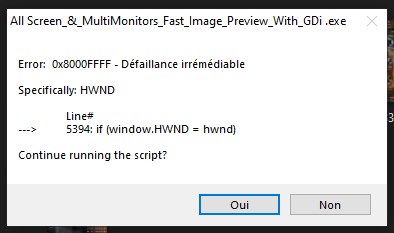
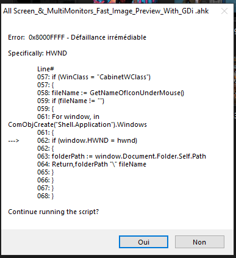
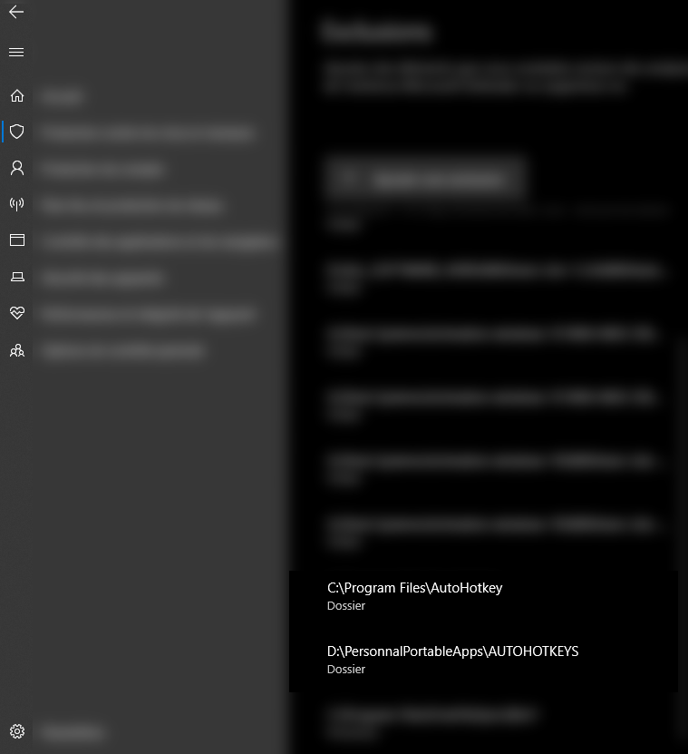

This is where i got the idea, i used an old code from autohotkey official forum as a starting point: 👉https://www.autohotkey.com/boards/viewtopic.php?t=106962

🌞🌞Now take a look at this, a much more improved version working with GDI+ and working with every screen size, so give it a try 🌹🌹🌹

🖼️ Fast Image Preview with GDI+

QuickLook‑style image previews for Windows desktop and Explorer, powered by AutoHotkey and GDI+.  
Hold Left Ctrl over an image file icon to instantly see a scaled preview window near your mouse.

📌 Scripts Included

1. FastImagePreviewWithGDI+ Original.ahk
- 🎯 Purpose: Quick image preview on a fixed widescreen (1920×1080).  
- ⚙️ Behavior:  
  - Detects file under mouse pointer.  
  - Loads image formats (.png, .jpg, .bmp, .gif, .tiff, .webp, etc.).  
  - Scales longest side to 800px.  
  - Shows preview window near mouse.  
- ⚠️ Limitations:  
  - Hardcoded for 1920×1080 resolution.  
  - Preview may go off‑screen on smaller monitors.  
  - No multi‑monitor support.  
- 🎥 Demo: YouTube showcase
-Demo original😉  👉https://youtu.be/i-HDpToqw7k👈

2. All Screen & MultiMonitors FastImagePreviewWithGDI+.ahk
- 🚀 Purpose: Improved version that works on any resolution and supports multiple monitors.  
- ⚙️ Enhancements:  
  - Detects monitor where mouse is located.  
  - Scales preview to 80% of monitor size or 800px, whichever is smaller.  
  - Smart positioning logic:
    - Places preview to the right of mouse if possible.  
    - Falls back to left if needed.  
    - Adjusts vertically to avoid cursor overlap.  
    - Clamps to screen edges so preview never goes off‑screen.  
- ✅ Result: Robust, adaptive, and reliable across laptops, ultrawides, and multi‑monitor setups.

🛠️ Requirements
- Windows (tested on 7/10/11).  
- AutoHotkey v1.1 (download from autohotkey.com).  
- GDI+ library (Gdip_All.ahk) — included in most AHK GDI+ packages.  

📥 Installation
1. 📦 Decompress ZIP (if provided).  
2. 💻 Install AutoHotkey (v1.1 recommended).  
3. 📂 Place scripts (.ahk) and Gdip_All.ahk in the same folder.  
4. ▶️ Run the script by double‑clicking the .ahk file.  

🎮 Usage
- 🔑 Trigger: Hold Left Ctrl while hovering over an image file icon (desktop or Explorer).  
- 🖼️ Preview: A borderless window appears near the mouse.  
- ✋ Close: Release Left Ctrl to dismiss the preview.  
- 📑 Supported formats: .ico, .png, .jpg, .jpeg, .bmp, .gif, .tif, .tiff, .webp.  

📝 Recommendation
- Use Original if you only work on a fixed widescreen (1920×1080).  
- Use All Screen & MultiMonitors for adaptive handling across different resolutions and multi‑monitor setups.

🌿🌹 Demo of the enhanced version 🌹🌿

# 🐛 Bug Description and Fixes

## 🔍 The Issues

### 1. 💥 COM Object Instability

**The Bug:** The script was creating a single `Shell.Application` COM object at startup and reusing it throughout the entire session. COM objects can become stale or unresponsive over time, especially when Windows Explorer windows are opened/closed or the explorer.exe process is restarted. This caused the script to stop detecting file paths in Explorer windows, requiring users to restart the entire script or even restart explorer.exe. 😤

**The Fix:** ✅ Implemented a `RefreshShellApp()` function that:

* 🔄 Automatically refreshes the COM object every 30 seconds
* 🆕 Recreates the COM object if it becomes null/invalid
* 🛡️ Includes proper error handling with try-catch blocks
* 🎯 Gracefully degrades by returning empty strings on failures rather than crashing
* 🧹 Releases the old COM object before creating a new one to prevent memory leaks

 

### 2. 💾 Memory Management Issues

**The Bug:** The script wasn't properly cleaning up GDI+ bitmap objects when switching between images or when the preview was hidden. This caused memory leaks that accumulated over extended use, potentially leading to performance degradation and the "screenshot errors" users experienced (GDI+ running out of resources). 📉

**The Fix:** ✅ Added comprehensive cleanup:

* 🗑️ Properly disposes of `hBitmap` using `Gdip_DisposeImage()` before loading new images
* 🧽 Cleans up bitmap when hiding the preview (Ctrl release)
* 🚮 Cleans up bitmap when no valid file path is detected
* 🔚 Releases the COM object on script exit with `shellApp := ""`

 

### 3. ⚠️ Error Handling for COM Operations

**The Bug:** When COM operations failed (accessing Explorer windows, getting folder paths), the script would encounter errors without proper exception handling, causing it to stop functioning or display incorrect previews. ❌

**The Fix:** ✅ Wrapped all COM operations in try-catch blocks:

* 🔁 Individual exception handling for each window iteration
* ➡️ Graceful continuation when one window fails
* 🔄 Forces COM object refresh on major failures
* 📝 Returns empty strings instead of crashing

---

## 🛠️ Additional Setup Requirements

### 🛡️ Windows Defender Exceptions

You may need to add exceptions in Windows Defender for:

* 📄 The `.ahk` script file
* ⚙️ The compiled `.exe` file
* 📁 The script's working directory

This prevents Defender from interfering with the script's file system and COM access operations.

 

### 🔄 Explorer Restart (Previously Required)

In earlier versions, users needed to restart `explorer.exe` to get the script working after certain Windows updates or system changes. The COM refresh mechanism now handles this automatically without requiring manual Explorer restarts. 🎉

⚠️⚠️ Previous Bugs ⚠️⚠️

📣 Bug using EXE

📣 Bug Using AHK

mage.Preview.gif Settings](Images/Fast.Image.Preview.gif)

⚠️⚠️ Previous Bugs ⚠️⚠️

📣 Bug using EXE

📣 Bug Using AHK

🎯 👉 SOLUCE 👈

🛠️ Windows Defender Exception for the script (Solved Only Desktop Preview)

👀 Fix 1 for
